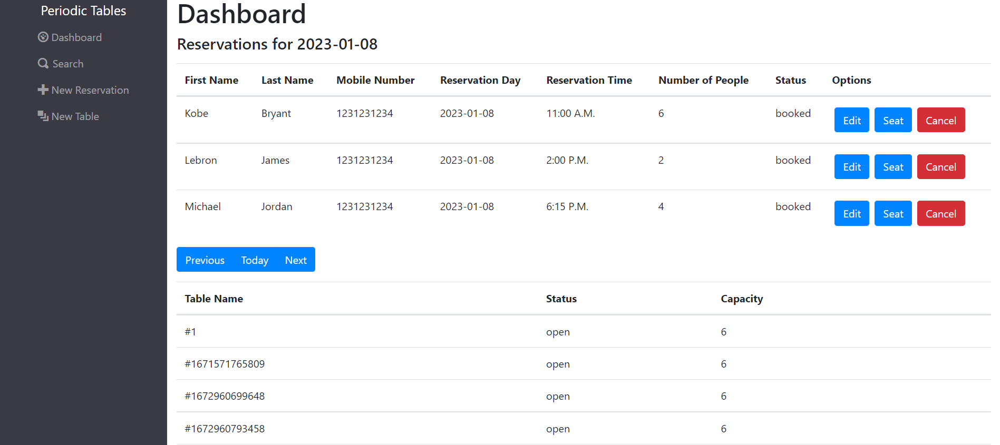
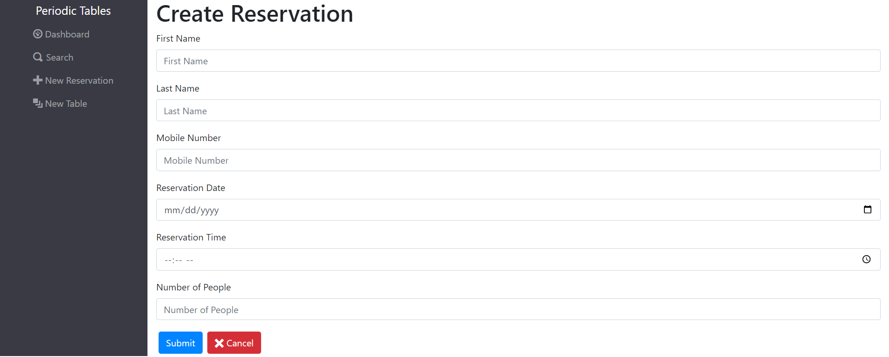
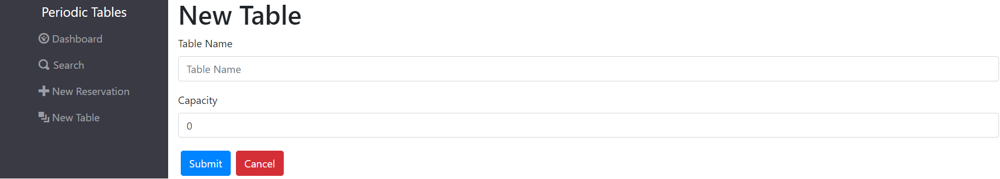
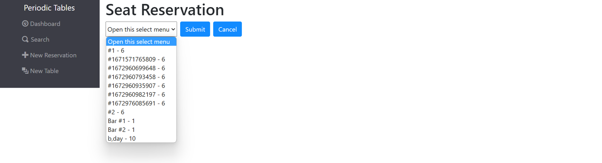
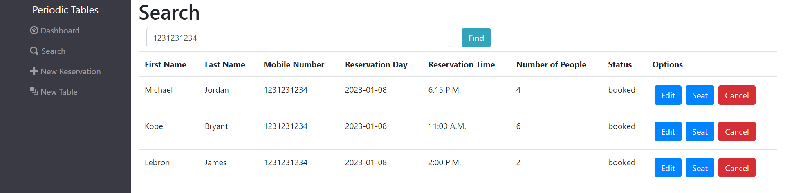

# [Restaurant Reservation Capstone](https://restaurant-reservation-app-navy.vercel.app/dashboard)

## Summary

I completed this full-stack web application as a capstone project for Thinkful's Software Engineering Bootcamp Program. The technologies required to use in this project are React for the front-end, Node.js and Express for the API, and PostgreSQL for the database. 

Instructions:

> "You have been hired as a full stack developer at Periodic Tables, a startup that is creating a reservation system for fine dining restaurants. 
> The software is used only by restaurant personnel when a customer calls to request a reservation. 
> At this point, the customers will not access the system online."

The original assignment can be found at [Thinkful-Ed/starter-restaurant-reservation](https://github.com/Thinkful-Ed/starter-restaurant-reservation).

## Deployed Application

## Application "[Periodic Tables](https://https://restaurant-reservation-app-navy.vercel.app/dashboard)" Deployed 

### [Github repo /Frontend](https://github.com/GPVcode/Restaurant-Reservation-App/tree/gpv-dev/front-end) - Deployed via Vercel
### [Github repo /Backend](https://github.com/GPVcode/Restaurant-Reservation-App/tree/gpv-dev/back-end) - Deployed via Render 

# Client Descriptions

### Dashboard

The Dashboard page shows reservations for each calendar date. Listed reservations contain buttons to Seat, Edit, or Cancel the reservation. The dashboard also lists all tables; each occupied table has a finish button so the client can free up the table.

### Create a Reservation

Create a new reservation providing the first name, last name, mobile number, date, time, and party size the reservation.

### Create a Table

Create a new table and assign a table name and capacity.

### Edit Reservation

Edit the information of a selected reservation.

### Seat Reservation

Assign a reservation to a table.

### Search

Search for reservations via mobile number

## Installation

1. Fork and clone this repository.
1. Run `cp ./back-end/.env.sample ./back-end/.env`.
1. Update the `./back-end/.env` file with the connection URL's to your ElephantSQL database instance.
1. Run `cp ./front-end/.env.sample ./front-end/.env`.
1. You should not need to make changes to the `./front-end/.env` file unless you want to connect to a backend at a location other than `http://localhost:5000`.
1. Run `npm install` to install project dependencies.
1. Run `npm run start:dev` to start your server in development mode.
